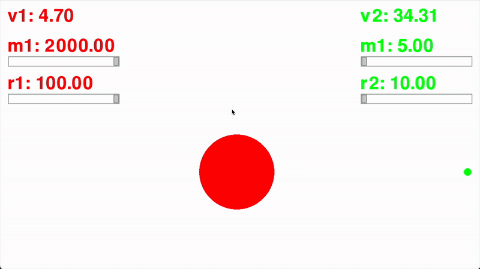

# Particle Collision Simulator
A Python-based particle collision simulator built with Pygame that allows interactive control of particle mass and radius, demonstrating real-time elastic collisions.

## Demo

## Usage
1. Install dependencies: `pip install -r requirements.txt`
2. Run `main.py` to start the simulator.
3. Use the sliders to adjust particle mass and radius.
4. Press **Space** to reset, **F** to toggle fullscreen, and **R** to reset the display size.